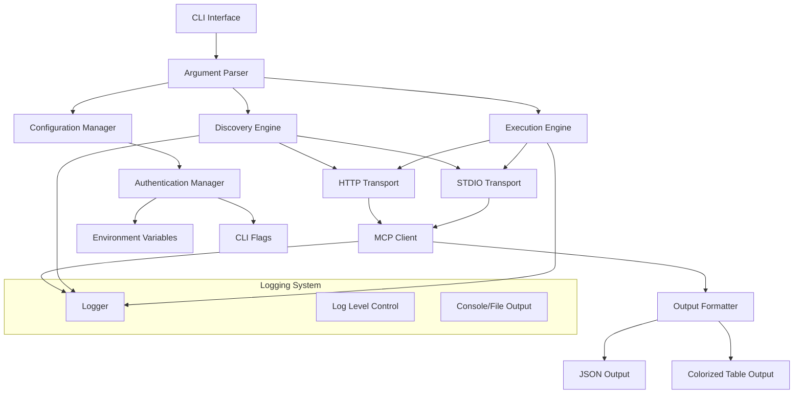
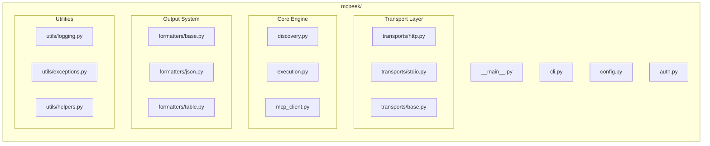
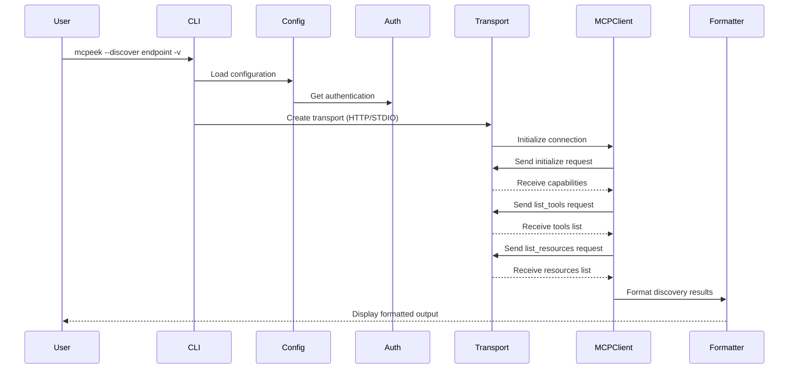
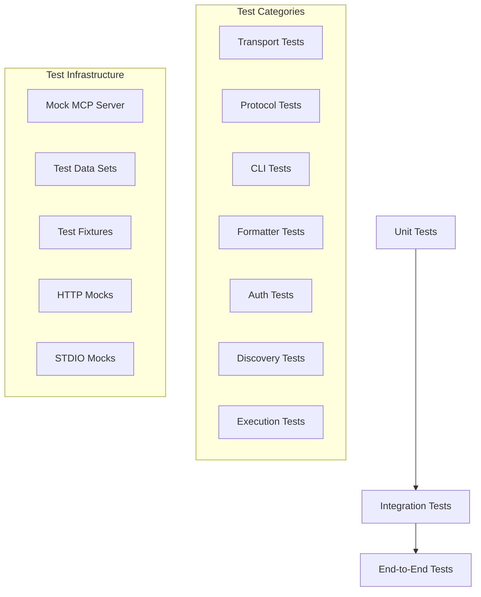

# MCPeek Architecture Design

## Overview

MCPeek is a Python 3 command-line tool designed to be a "swiss army knife" for AI hackers to explore and interact with Model Context Protocol (MCP) endpoints. It supports both HTTP/S and STDIO transport mechanisms and provides elegant discovery and interaction capabilities.

## Key Requirements

1. Support both HTTP/S and STDIO MCP endpoints
2. Include a `--discover` switch that explores all available functionality
3. Provide options to call individual MCP functions
4. Support data input via `--stdin` or input files
5. Be elegant and user-friendly
6. Support JSON and colorized human-readable output formats
7. Multiple verbosity levels for discovery (`-v`, `-vv`, `-vvv`)
8. Authentication via environment variables and command-line flags
9. Standard logging levels with `--log-level` flag

## Core Architecture



## Component Structure



## Command-Line Interface Design

### Basic Usage Examples

```bash
# Basic discovery
mcpeek --discover <endpoint>

# Discovery with verbosity levels
mcpeek --discover <endpoint> -v          # Brief info
mcpeek --discover <endpoint> -vv         # Detailed info
mcpeek --discover <endpoint> -vvv        # Full schema info

# Execute specific tools
mcpeek --endpoint <endpoint> --tool <tool_name> [--input <data>]
mcpeek --endpoint <endpoint> --tool <tool_name> --stdin

# Access resources
mcpeek --endpoint <endpoint> --resource <resource_uri>

# Output formatting
mcpeek --discover <endpoint> --format json
mcpeek --discover <endpoint> --format table

# Authentication
mcpeek --endpoint <endpoint> --api-key <key>
mcpeek --endpoint <endpoint> --auth-header "Bearer <token>"

# Logging
mcpeek --discover <endpoint> --log-level DEBUG

# Transport-specific options
mcpeek --discover http://localhost:8000/mcp    # HTTP transport
mcpeek --discover ./mcp-server                 # STDIO transport
```

### Verbosity Levels

- **No `-v`**: Brief overview (tool names, resource URIs, prompt names)
- **`-v`**: Detailed info (descriptions, parameter names)
- **`-vv`**: More detailed (parameter types, required fields)
- **`-vvv`**: Full schema (complete JSON schema, examples)

## Core Classes and Modules

### 1. CLI Interface (`cli.py`)

```python
class MCPeekCLI:
    """Main CLI interface using argparse"""

    def setup_parser(self) -> argparse.ArgumentParser:
        """Configure command-line argument parser"""

    def parse_arguments(self, args: List[str]) -> argparse.Namespace:
        """Parse and validate command-line arguments"""

    def validate_arguments(self, args: argparse.Namespace) -> None:
        """Validate argument combinations and requirements"""

    def execute_command(self, args: argparse.Namespace) -> int:
        """Execute the requested command and return exit code"""
```

### 2. Configuration Manager (`config.py`)

```python
class ConfigManager:
    """Handles configuration from CLI args and environment"""

    def load_config(self, args: argparse.Namespace) -> Dict[str, Any]:
        """Load configuration from multiple sources"""

    def validate_config(self, config: Dict[str, Any]) -> None:
        """Validate configuration completeness and correctness"""

    def get_endpoint_config(self, endpoint: str) -> EndpointConfig:
        """Get configuration for specific endpoint"""

    def merge_cli_and_env_config(self, cli_args: Dict, env_vars: Dict) -> Dict:
        """Merge CLI arguments with environment variables"""
```

### 3. Authentication Manager (`auth.py`)

```python
class AuthManager:
    """Handles authentication for MCP endpoints"""

    def get_auth_headers(self, endpoint: str) -> Dict[str, str]:
        """Generate authentication headers for endpoint"""

    def load_api_key(self, key_name: str) -> Optional[str]:
        """Load API key from environment or CLI"""

    def validate_credentials(self, endpoint: str) -> bool:
        """Validate that required credentials are available"""
```

### 4. Transport Layer (`transports/`)

```python
class BaseTransport(ABC):
    """Abstract base for all transports"""

    @abstractmethod
    async def connect(self) -> None:
        """Establish connection to MCP endpoint"""

    @abstractmethod
    async def send_message(self, message: Dict[str, Any]) -> None:
        """Send JSON-RPC message to endpoint"""

    @abstractmethod
    async def receive_message(self) -> Dict[str, Any]:
        """Receive JSON-RPC message from endpoint"""

    @abstractmethod
    async def close(self) -> None:
        """Close connection to endpoint"""

class HTTPTransport(BaseTransport):
    """HTTP/HTTPS transport implementation"""

    def __init__(self, url: str, auth_headers: Dict[str, str]):
        """Initialize HTTP transport with URL and auth"""

    async def connect(self) -> None:
        """Establish HTTP connection using aiohttp"""

    async def send_message(self, message: Dict[str, Any]) -> None:
        """Send HTTP POST request with JSON-RPC payload"""

    async def receive_message(self) -> Dict[str, Any]:
        """Handle SSE or polling for responses"""

class STDIOTransport(BaseTransport):
    """STDIO transport for local processes"""

    def __init__(self, command: List[str]):
        """Initialize STDIO transport with command"""

    async def connect(self) -> None:
        """Start subprocess and establish stdio communication"""

    async def send_message(self, message: Dict[str, Any]) -> None:
        """Send JSON-RPC message via stdin"""

    async def receive_message(self) -> Dict[str, Any]:
        """Read JSON-RPC message from stdout"""
```

### 5. MCP Client (`mcp_client.py`)

```python
class MCPClient:
    """Core MCP protocol implementation"""

    def __init__(self, transport: BaseTransport):
        """Initialize client with transport layer"""

    async def initialize_connection(self) -> Dict[str, Any]:
        """Perform MCP initialization handshake"""

    async def negotiate_capabilities(self) -> Dict[str, Any]:
        """Negotiate client/server capabilities"""

    async def list_tools(self) -> List[Dict[str, Any]]:
        """Get list of available tools from server"""

    async def list_resources(self) -> List[Dict[str, Any]]:
        """Get list of available resources from server"""

    async def list_prompts(self) -> List[Dict[str, Any]]:
        """Get list of available prompts from server"""

    async def call_tool(self, name: str, arguments: Dict[str, Any]) -> Dict[str, Any]:
        """Execute a specific tool with arguments"""

    async def read_resource(self, uri: str) -> Dict[str, Any]:
        """Read a specific resource by URI"""

    async def get_prompt(self, name: str, arguments: Dict[str, Any]) -> Dict[str, Any]:
        """Get a specific prompt with arguments"""
```

### 6. Discovery Engine (`discovery.py`)

```python
class DiscoveryEngine:
    """Discovers and catalogs MCP endpoint capabilities"""

    def __init__(self, client: MCPClient, verbosity: int):
        """Initialize discovery engine with client and verbosity level"""

    async def discover_endpoint(self) -> DiscoveryResult:
        """Perform complete endpoint discovery"""

    async def get_server_info(self) -> Dict[str, Any]:
        """Get basic server information and capabilities"""

    async def catalog_tools(self) -> List[ToolInfo]:
        """Catalog all available tools with appropriate detail level"""

    async def catalog_resources(self) -> List[ResourceInfo]:
        """Catalog all available resources with appropriate detail level"""

    async def catalog_prompts(self) -> List[PromptInfo]:
        """Catalog all available prompts with appropriate detail level"""

    def generate_discovery_report(self, discovery_result: DiscoveryResult) -> str:
        """Generate formatted discovery report"""
```

### 7. Execution Engine (`execution.py`)

```python
class ExecutionEngine:
    """Executes specific MCP operations"""

    def __init__(self, client: MCPClient):
        """Initialize execution engine with MCP client"""

    async def execute_tool(self, tool_name: str, input_data: Any) -> Dict[str, Any]:
        """Execute a specific tool with input data"""

    async def read_resource(self, resource_uri: str) -> Dict[str, Any]:
        """Read a specific resource"""

    def process_input_data(self, input_source: str) -> Dict[str, Any]:
        """Process input data from file or string"""

    async def handle_stdin_input(self) -> Dict[str, Any]:
        """Handle input data from stdin"""

    def validate_tool_parameters(self, tool_schema: Dict, arguments: Dict) -> None:
        """Validate tool arguments against schema"""
```

### 8. Output Formatters (`formatters/`)

```python
class BaseFormatter(ABC):
    """Abstract base for output formatters"""

    @abstractmethod
    def format_discovery_result(self, result: DiscoveryResult) -> str:
        """Format discovery results for output"""

    @abstractmethod
    def format_tool_result(self, result: Dict[str, Any]) -> str:
        """Format tool execution results"""

    @abstractmethod
    def format_error(self, error: Exception) -> str:
        """Format error messages"""

class JSONFormatter(BaseFormatter):
    """JSON output formatting"""

    def __init__(self, pretty_print: bool = True):
        """Initialize JSON formatter with pretty-print option"""

    def format_discovery_result(self, result: DiscoveryResult) -> str:
        """Format as pretty-printed JSON"""

    def format_tool_result(self, result: Dict[str, Any]) -> str:
        """Format tool results as JSON"""

class TableFormatter(BaseFormatter):
    """Human-readable table formatting"""

    def __init__(self, use_colors: bool = True):
        """Initialize table formatter with color option"""

    def format_discovery_result(self, result: DiscoveryResult) -> str:
        """Format as colorized tables using rich"""

    def format_tool_result(self, result: Dict[str, Any]) -> str:
        """Format tool results as structured tables"""
```

## Data Flow Architecture



## Error Handling Strategy

### Exception Hierarchy

```python
class MCPeekException(Exception):
    """Base exception for MCPeek"""

    def __init__(self, message: str, details: Optional[Dict] = None):
        super().__init__(message)
        self.details = details or {}

class ConnectionError(MCPeekException):
    """Connection-related errors"""
    pass

class AuthenticationError(MCPeekException):
    """Authentication failures"""
    pass

class ProtocolError(MCPeekException):
    """MCP protocol violations"""
    pass

class ValidationError(MCPeekException):
    """Input validation errors"""
    pass

class TimeoutError(MCPeekException):
    """Operation timeout errors"""
    pass
```

### Error Recovery Strategies

1. **Connection Errors**: Retry with exponential backoff
2. **Authentication Errors**: Clear guidance on credential setup
3. **Protocol Errors**: Detailed error messages with context
4. **Validation Errors**: Specific field-level error reporting
5. **Timeout Errors**: Configurable timeout values

## Logging Architecture

### Logging Configuration

```python
class LoggingManager:
    """Centralized logging configuration"""

    def setup_logging(self, level: str, format_type: str = "structured") -> None:
        """Configure logging with specified level and format"""

    def configure_log_level(self, level: str) -> None:
        """Set logging level (DEBUG, INFO, WARNING, ERROR)"""

    def create_structured_logs(self, context: Dict[str, Any]) -> None:
        """Create structured log entries with context"""

    def handle_log_rotation(self, max_size: int, backup_count: int) -> None:
        """Configure log rotation if file logging is enabled"""
```

### Log Levels

- **DEBUG**: Detailed protocol messages, request/response data
- **INFO**: High-level operations, connection status
- **WARNING**: Recoverable errors, deprecated features
- **ERROR**: Unrecoverable errors, failed operations

## Security Considerations

### Authentication Security

1. **Environment Variables**: Prefer `MCPEEK_API_KEY` over CLI flags
2. **No Credential Storage**: Never store credentials in command history
3. **Secure Transmission**: Always use HTTPS for HTTP transport
4. **Header Security**: Proper handling of authentication headers

### Input Validation

1. **Endpoint URLs**: Validate URL format and allowed schemes
2. **File Paths**: Sanitize file paths for STDIO transport
3. **JSON-RPC Messages**: Validate message structure and content
4. **User Input**: Sanitize all user-provided input data

### Network Security

1. **Certificate Validation**: Always validate HTTPS certificates
2. **Timeout Handling**: Prevent hanging connections
3. **Rate Limiting**: Respect server rate limits
4. **Connection Limits**: Limit concurrent connections

## Performance Optimizations

### Async Operations

1. **HTTP Transport**: Use `aiohttp` for non-blocking HTTP operations
2. **Concurrent Discovery**: Parallel discovery of tools/resources/prompts
3. **STDIO Transport**: Non-blocking I/O for subprocess communication
4. **Connection Pooling**: Reuse HTTP connections when possible

### Caching Strategy

1. **Discovery Results**: Cache endpoint capabilities
2. **Schema Information**: Cache tool/resource schemas
3. **Connection State**: Maintain connection state for efficiency
4. **Authentication**: Cache authentication tokens when appropriate

### Resource Management

1. **Connection Cleanup**: Proper cleanup of all connections
2. **Memory Efficiency**: Stream large responses instead of loading in memory
3. **Process Management**: Clean subprocess lifecycle for STDIO transport
4. **Graceful Shutdown**: Handle interruption signals properly

## Testing Strategy

### Test Categories



### Test Implementation

1. **Unit Tests**: Test individual components in isolation
2. **Integration Tests**: Test component interactions
3. **End-to-End Tests**: Test complete workflows
4. **Mock Infrastructure**: Mock MCP servers for testing
5. **Error Scenarios**: Test error handling and recovery

## Deployment and Distribution

### Package Structure

```
mcpeek/
├── pyproject.toml
├── README.md
├── LICENSE
├── src/
│   └── mcpeek/
│       ├── __init__.py
│       ├── __main__.py
│       ├── cli.py
│       ├── config.py
│       ├── auth.py
│       ├── transports/
│       ├── formatters/
│       ├── utils/
│       └── tests/
└── docs/
```

### Installation

```bash
# PyPI installation
pip install mcpeek

# Development installation
pip install -e .

# With optional dependencies
pip install mcpeek[dev,test]
```

### Dependencies

#### Core Dependencies
- `aiohttp>=3.8.0` - HTTP transport
- `rich>=13.0.0` - Colorized output
- `pydantic>=2.0.0` - Data validation
- `click>=8.0.0` - CLI framework

#### Optional Dependencies
- `pytest>=7.0.0` - Testing framework
- `black>=23.0.0` - Code formatting
- `mypy>=1.0.0` - Type checking

## Future Enhancements

### Phase 2 Features

1. **Configuration Files**: Support for YAML/TOML configuration files
2. **Interactive Mode**: REPL-style interactive exploration
3. **Plugin System**: Extensible plugin architecture
4. **Batch Operations**: Execute multiple operations in sequence
5. **Output Streaming**: Real-time streaming of large responses

### Phase 3 Features

1. **Web Interface**: Optional web-based exploration interface
2. **Monitoring**: Built-in monitoring and metrics collection
3. **Caching Layer**: Persistent caching of discovery results
4. **Load Testing**: Built-in load testing capabilities
5. **Documentation Generation**: Auto-generate API documentation

## Conclusion

This architecture provides a robust, extensible foundation for MCPeek that:

- Follows MCP specification guidelines
- Implements clean separation of concerns
- Supports both HTTP/S and STDIO transports
- Provides elegant user experience
- Includes comprehensive error handling
- Supports multiple output formats
- Implements proper security practices
- Allows for future extensibility

The modular design ensures that each component can be developed, tested, and maintained independently while working together to provide a seamless user experience for MCP endpoint exploration and interaction.